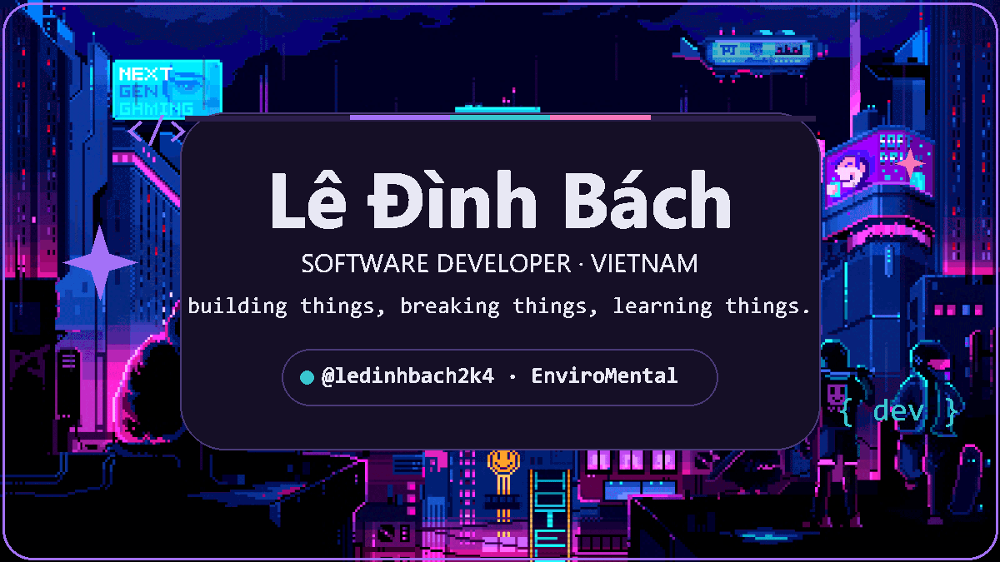

<!--
  👋 Welcome to my profile README!
  Replaceable visuals (all relative, so you can swap files without touching the README):
    • Hero banner  : ./assets/banner-final.gif   (background keeps ./assets/banner.gif as source)
    • Wave divider : ./assets/divider.svg  (or ./assets/divider.gif)
    • Animated emoji GIFs live in ./assets/emojis/, decorations in ./assets/decorations/
-->


<div align="center">

  

  <br /><br />

  <a href="https://github.com/ledinhbach2k4">
    <b>GitHub</b>
  </a>

  &nbsp;·&nbsp;

  <a href="https://www.linkedin.com/in/b%C3%A1ch-l%C3%AA-%C4%91%C3%ACnh-4b39302b8/">
    <b>LinkedIn</b>
  </a>

</div>

<div align="center">
  
</div>

## 👋 about me

Hey, I'm **Bách**, a developer from Vietnam.

I take random ideas and turn them into small apps, scripts and websites — then I keep tinkering until they actually work. These days that mostly means **React Native**, **Node.js** and a growing interest in **Java / Spring Boot**.

## 🌱 currently

```text
🌱 building    EnviroMental    a React Native app that tracks how the environment affects mental health
📱 exploring   React Native / Expo
☕ learning    Java, Spring Boot & backend design
🎮 playing     with side projects on the weekend
🎧 listening   see below 👇
```

## 🛠 tech

The tools I actually pick up in my repos:

<p align="center">
  
</p>
<p align="center">
  
</p>
<p align="center">
  
</p>

## 🚀 things I've built

| 🌱 **EnviroMental** | 🛒 **TechTop Store** |
| :--- | :--- |
| React Native app that tracks how environmental factors impact mental health — my main project right now.<br/><br/><br/><br/>[**view project →**](https://github.com/ledinhbach2k4/EnviroMental) | A store product line spread across three repos: web frontend, REST API and Android app.<br/><br/><br/><br/>[**web**](https://github.com/ledinhbach2k4/TechTopStore-Website-JavaScript) · [**api**](https://github.com/ledinhbach2k4/TechTopStoreWebApi) · [**android**](https://github.com/ledinhbach2k4/TechTopStoreAndroid) |
| 🌻 **bro-shop** | 🎬 **YouTubeDownloader** |
| A little shop page I built with my bro back in Hue Industrial College — early CSS days, good memories.<br/><br/><br/><br/>[**view project →**](https://github.com/ledinhbach2k4/bro-shop) | A tiny Python script — sometimes past-me just needed a specific tool. A lesson in *"just ship it"*.<br/><br/><br/><br/>[**view project →**](https://github.com/ledinhbach2k4/YouTubeDownloader) |

## 🎧 what I'm listening to

<div align="center">
  <a href="https://data-card-for-spotify.herokuapp.com/card?user_id=31sqc7ymg32an4rw4nbzf2ocwce4">
    
  </a>
</div>

## 📊 GitHub

<div align="center">
  <picture>
    <source media="(prefers-color-scheme: dark)" srcset="./metrics.languages.dark.svg" />
    
  </picture>

  <br /><br />

  <picture>
    <source media="(prefers-color-scheme: dark)" srcset="./metrics.isocalendar.dark.svg" />
    
  </picture>
</div>

## 🌐 find me

<div align="center">
  <a href="https://github.com/ledinhbach2k4"><b>GitHub</b></a>
  &nbsp;·&nbsp;
  <a href="https://www.linkedin.com/in/b%C3%A1ch-l%C3%AA-%C4%91%C3%ACnh-4b39302b8/"><b>LinkedIn</b></a>
</div>

<div align="center">
  <sub>
    if you read this far, you're cool 😎 &nbsp;·&nbsp; made with ☕ and
    <a href="https://github.com/lowlighter/metrics">lowlighter/metrics</a>
  </sub>
</div>