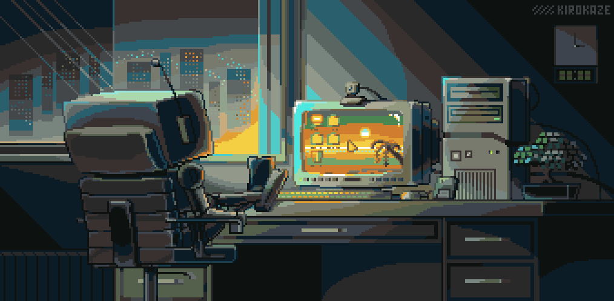

<!--Header Name-->
#  ɪ'ᴠLeDinhBach! 
*(Hardware engineer / IT Support)*
  

<!--Start Intro-->               

  I am a Computer Hardware Specialist with a strong passion for designing, building, and maintaining computer systems and networks.  
  ☕ If you find my work helpful and want to support me: <a href="https://paypal.me/ledinhbach/2" target="_blank"><b>Buy me a coffee</b></a>

- ✨ Lifelong learner :)
- 🌱 Continuously expanding my knowledge in computer hardware and systems.
<!--End Intro-->

<!--Banner-->

<!--Contact Section--> 
<h2 align="center">🤝 This is my Social-Network 🤝 </h2>

  

 

<!--Music Section--> 
<h2 align="center">🎶 Music-Status 🎶 </h2>

<!--Spotify--> 

 

<!--Footer--> 

  

